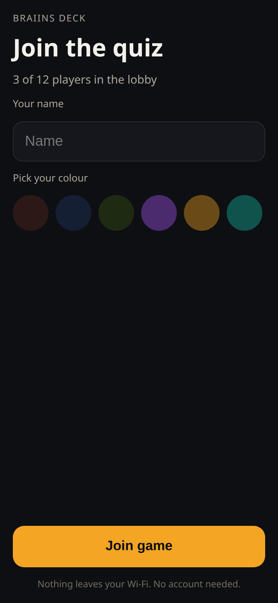
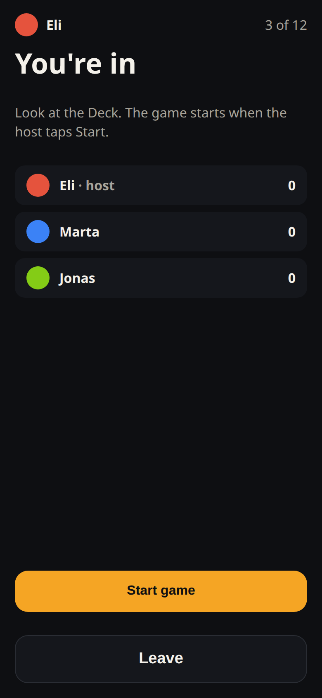
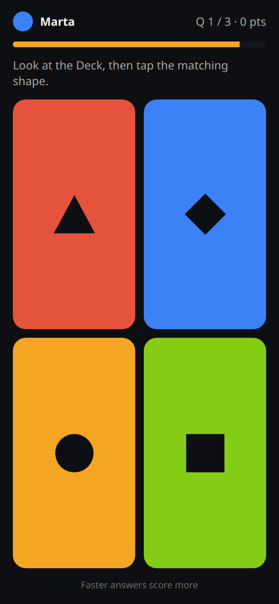
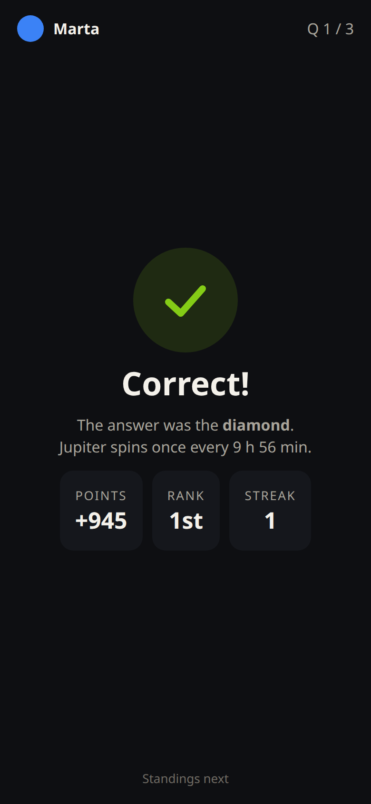
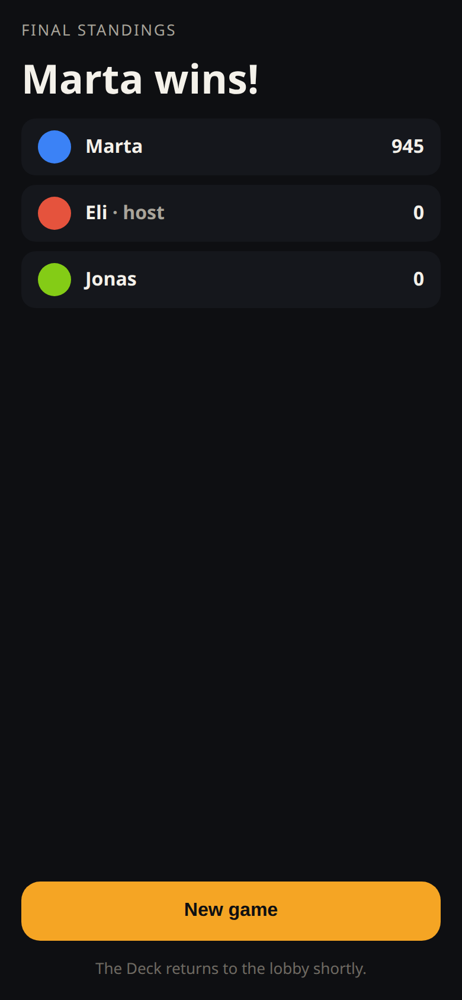
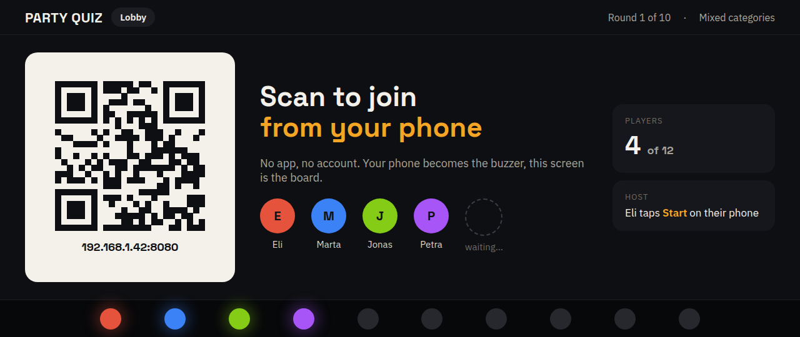
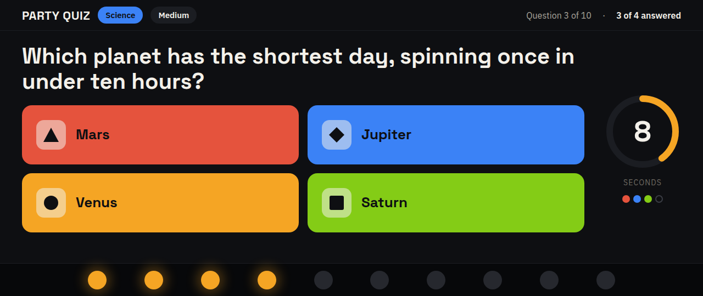
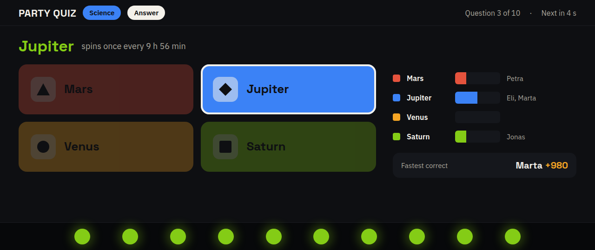
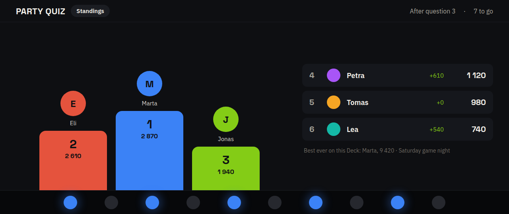

# BraiinsForgeWidgets

Widgets for the [Braiins Deck](https://braiinsforge.com/hardware/braiins-deck), one Rust crate per widget, built to
WebAssembly against the Deck SDK from [BraiinsForge/bmc-main](https://github.com/BraiinsForge/bmc-main).

## Widgets

| Widget | Folder | Status |
| --- | --- | --- |
| Party Quiz, phones as buzzers | [`party-quiz/`](party-quiz/) | Playing on a Deck with firmware 26.09; prebuilt package in [`dist/`](dist/) |

### Party Quiz

The Deck is the game-show board, every phone is a buzzer. Players scan a QR code on the Deck, pick a name and a
colour, and answer with four colour-and-shape buttons while the Deck shows the question, a countdown ring, the reveal
with the room's votes, and a podium. Lights and sounds follow every stage. Nothing leaves the Wi-Fi.

Phone controller, captured from the real page:

<p>
  
  
  
  
  
</p>

Deck screens, design mockups at the Deck's 1280x480 proportions (the LED strip below the panel is drawn in):

<p>
  
  
  
  
</p>

## Install Party Quiz on your Deck

### Quick install, no build tools

If you only want to play, you need `ssh`, the Deck's root password (set in its web app), and one file from
[`dist/`](dist/):

```shell
git clone https://github.com/elinagar/BraiinsForgeWidgets.git && cd BraiinsForgeWidgets
scripts/install-prebuilt.sh dist/party-quiz-0.1.0.nar <deck-ip>
```

The script copies the prebuilt package to the Deck, imports it with the Deck's own Nix, and adds it to the application
profile with `bmc-nix-cli`; the whole thing takes seconds and nothing is installed on your computer. Then add
**Party Quiz** to a fullscreen scene in the Deck's web app, turn off scene cycling, swipe to the scene and scan the QR
code. The Deck must run firmware 26.09. On a stock Deck the game is silent; sounds need the runtime patch from the
full install below. The Deck's next official update removes the widget until you run the script again.

### Full install, for building and changing the widget

The Deck installs software as Nix packages, so the widget is built and pushed with the Nix tooling from
[BraiinsForge/bmc-main](https://github.com/BraiinsForge/bmc-main). You need a Linux or macOS machine on the same
network as the Deck, about 20 GB of free disk for the first build, and an hour the first time. Later updates take a
few minutes.

1. **Update the Deck** to firmware 26.09 or newer from its web app (Settings, Software update). The widget targets the
   SDK of that release.
2. **Install the tools** once:

   ```shell
   curl --proto '=https' --tlsv1.2 -sSf -L https://install.determinate.systems/nix | sh -s -- install
   sudo apt install git-lfs && git lfs install      # or your distro's equivalent
   ```

   Open a new shell afterwards so `nix` is on your PATH.
3. **Get the two repositories:**

   ```shell
   git clone https://github.com/elinagar/BraiinsForgeWidgets.git
   git clone https://github.com/BraiinsForge/bmc-main.git && (cd bmc-main && git lfs pull)
   ```

   If bmc-main's build fails with `Cannot find Git revision '01153df…' in ref 'refs/heads/master' of repository
   'https://github.com/yvind/egui_autocomplete.git'`, the fix is in [Troubleshooting](#troubleshooting).
4. **Find the Deck's IP address** by swiping down from the top of its screen, and let SSH in without a password:

   ```shell
   ssh-copy-id root@<deck-ip>        # password: the one you set in the Deck's web app
   ```
5. **Deploy.** The first run ships every package built from bmc-main so the widget and the Deck's runtime match;
   later runs ship only the widget:

   ```shell
   cd BraiinsForgeWidgets
   scripts/deploy.sh party-quiz ../bmc-main <deck-ip> --first   # first time
   scripts/deploy.sh party-quiz ../bmc-main <deck-ip>           # updates
   ```
6. **Sounds (optional but recommended).** A stock bmc-main build silently drops every WASM widget's sounds on the
   device: the runtime's audio playback is a compile-time feature that only the desktop testbed enables, and the
   Deck's sound card is exclusive, so the stock code would also lock out the Deck's own alarms if it were switched on.
   `patches/bmc-main-wasm-audio-on-device.patch` enables the feature for device builds and makes the runtime open the
   card only while a clip plays. Apply it to bmc-main before deploying, then run the first deploy again so the
   rebuilt runtime ships:

   ```shell
   git -C ../bmc-main apply ../BraiinsForgeWidgets/patches/bmc-main-wasm-audio-on-device.patch
   ```

   Without the patch the game plays fine, just silently.
7. **Play.** In the Deck's web app add **Party Quiz** to a fullscreen scene, turn off scene cycling (phones can only
   reach the widget while its scene is on screen), swipe to the scene and scan the QR code.
8. **Afterwards**, re-enable the Deck's automatic updates, which `deploy` switches off so they do not overwrite your
   packages. Note that the next official update will remove the widget until you deploy it again:

   ```shell
   cd ../bmc-main && nix run .#deck -- register-server --device <deck-ip>
   ```

### Troubleshooting

- **`Cannot find Git revision '01153df…' … egui_autocomplete`** during the build. bmc-main pins a testbed crate to
  a commit that its fork has since rebased away, so Nix cannot find it on a branch. GitHub still serves the commit by
  hash; fetch it into Nix's cache once and rebuild:

  ```shell
  d=$(for r in ~/.cache/nix/gitv3/*/; do git -C "$r" config --get remote.origin.url | grep -q yvind/egui_autocomplete && echo "$r"; done | head -1)
  git -C "$d" fetch origin 01153df7c1915bb1196d0d97acf44a2783890016
  git -C "$d" update-ref refs/heads/pin-egui-0.34 01153df7c1915bb1196d0d97acf44a2783890016
  ```

  (Run the deploy once first so the cache directory exists.)
- **The phone says "The Deck is showing another scene."** Scene cycling moved the Deck away from Party Quiz; swipe
  back or turn cycling off.
- **The phone says "Cannot reach the Deck at …".** The phone is not on the Deck's network, or a guest network isolates
  clients. Join the same Wi-Fi as the Deck.
- **The QR code changed.** Every widget reload picks a new port; rescan.
- **No sound from the Deck.** Widget audio needs the runtime patch from step 6; also check Night Mode, which lowers
  or mutes the volume during quiet hours, and the widget's *Sounds* parameter.
- **The screen dimmed and the lights stopped.** Night Mode. Turn it off for the evening in Settings, Display, or
  enable "LED Notifications in Night Mode" under Sound & Light.

Each widget has a user story in [`docs/USER_STORIES.md`](docs/USER_STORIES.md), a player guide in
[`docs/USER_DOC.md`](docs/USER_DOC.md), and its design in [`docs/TECHNICAL_DOC.md`](docs/TECHNICAL_DOC.md). Work in
progress is tracked in [`IMPLEMENTATION_PLAN.md`](IMPLEMENTATION_PLAN.md).

## Build

The Rust toolchain is pinned in `rust-toolchain.toml` (it includes the `wasm32-unknown-unknown` target). The SDK is a
git dependency pinned to the bmc-main commit matching the current Deck firmware, so a plain checkout builds without
Nix:

```shell
cargo test -p party-quiz                                        # host-side unit tests
cargo clippy -p party-quiz --target wasm32-unknown-unknown -- -D warnings
cargo build -p party-quiz --release --target wasm32-unknown-unknown
```

Run the phone controller page in a browser without a Deck:

```shell
cargo run -p party-quiz --example dev-server -- 8080
# open http://localhost:8080/ in two tabs
```

## Deploy to a Deck

Deployment uses bmc-main's Nix tooling, so the crate is copied into a bmc-main checkout first:

```shell
scripts/deploy.sh party-quiz /path/to/bmc-main "$DEVICE_IP" --first   # first time: every package
scripts/deploy.sh party-quiz /path/to/bmc-main "$DEVICE_IP"           # later: only the widget
```

Or step by step:

```shell
scripts/sync-to-bmc-main.sh party-quiz /path/to/bmc-main
cd /path/to/bmc-main
just wasm::dev party-quiz                                        # desktop testbed, hot reload
nix run .#deck -- deploy --device "$DEVICE_IP" --packages widget-party-quiz
```

The script rewrites the SDK dependency to the in-tree path and registers the crate in bmc-main's widget workspace.
Follow bmc-main's `README.md` for the development shell, `just validate`, and the visual-regression workflow.

## Conventions

- Widgets follow bmc-main's [widget best practices](https://github.com/BraiinsForge/bmc-main/blob/master/docs/devel/wasm-widgets/best-practices.md):
  pure logic in host-testable modules, host imports only behind `#[cfg(target_arch = "wasm32")]`, `fmt!` instead of
  `format!`, numbers through `format_number!`, fixed font sizes per viewport.
- After changing a `manifest.json`, regenerate the typed params with bmc-main's codegen
  (`just wasm::gen <widget>` inside bmc-main after syncing, then copy `src/manifest_params.rs` back).
- Sound assets are small PCM WAV files committed directly; bmc-main keeps them in Git LFS, so run `git lfs install`
  before syncing a widget with sounds into bmc-main.
- GPL-3.0-or-later, matching the SDK. Every Rust source carries the bmc-main license header.
